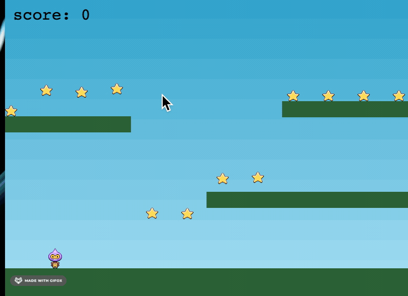

# phaser3-tutorial
implementation of the [phaser3 tutorial](http://phaser.io/tutorials/making-your-first-phaser-3-game/part1)

## Setup
Clone and install dependencies. The phaser3 package is unecessary, there is a script to load it actually. We just need `express` to serve static assets

`npm install`

## Static file serving
The browser will block access to static assets. To get around this, one option is to serve the images ourselves, or use a chrome extension. This is the one that worked for me. I was able to set CORS permissions explicitly to allow all '*'

## Start game
run the server with `npm start` and navigate to [localhost:8081](https://localhost:8081)

View the game on [phaser3-tutorial.herokuapp.com](https://phaser3-tutorial.herokuapp.com/)


## fixes
Tutorial code counts down the number of stars to 0, but I found this does not update synchornously, so the lowest number is actually 1.
```
if (stars.countActive(true) === 1) 
```
